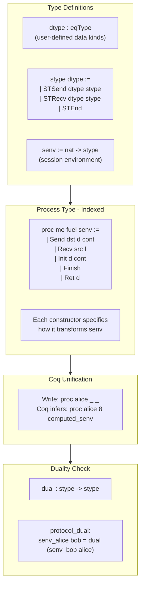
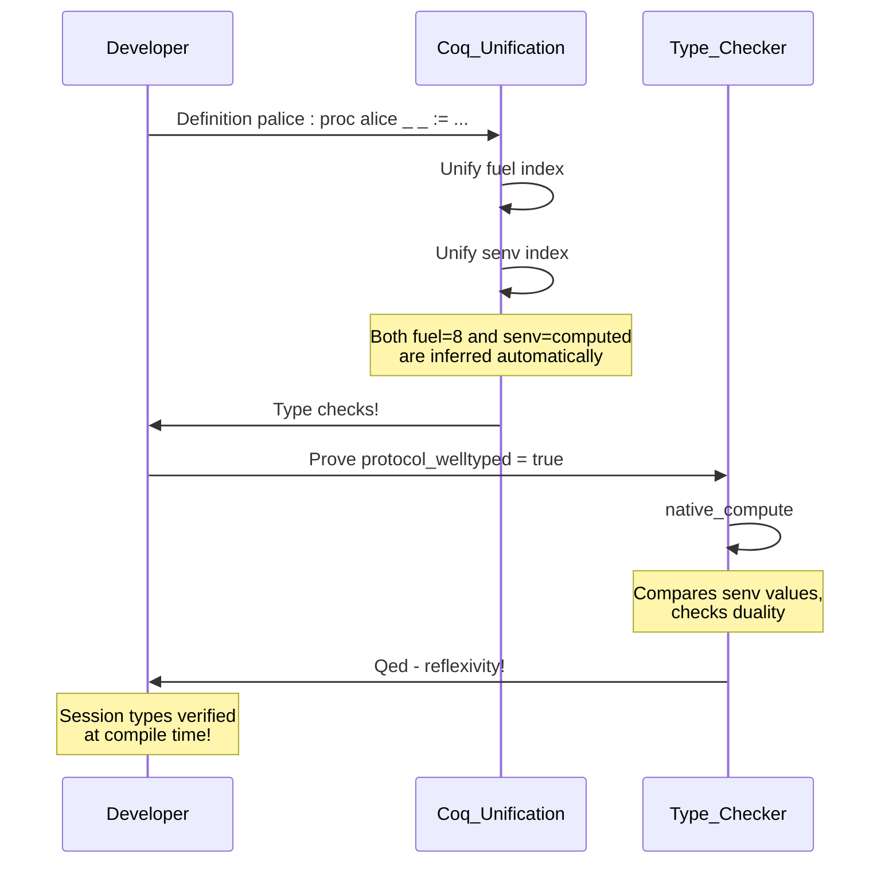

# Parameterized Session Types for SMC Interpreter

> Copied from Cursor plan on 2026-01-25

## Overview

Implement a fully type-indexed session type system where both fuel AND session types are automatically inferred by Coq's unification, while keeping surface syntax unchanged.

## Implementation Phases

- **Phase 1**: Define minimal stype, senv, proc types WITHOUT notations - verify basic unification
- **Phase 1**: Test inference on 2-operation process (e.g., Send then Finish)
- **Phase 2**: Define aproc existential wrapper with mk_aproc and accessor helpers
- **Phase 2**: Define Recv_vec, Recv_one wrappers with Fail for type mismatch
- **Phase 2**: Implement dual, stype_eqb, channels_dual functions
- **Phase 2**: Test duality check on simple 2-party protocol
- **Phase 3**: Add custom syntax notations incrementally, testing each
- **Phase 3**: Migrate scalar product protocol, verify surface syntax unchanged
- **Phase 3**: Prove scalar_product_welltyped by native_compute; reflexivity
- **Phase 4**: Update interpreter to work with new aproc (if needed)

---

## Problem

Adding session type checking to SMC protocols with:

1. **No combinatorial explosion**: Session types parameterized by user-defined data kinds
2. **Full automatic inference**: Both fuel AND session types inferred by Coq's unification
3. **Surface syntax unchanged**: Programs look exactly the same as before

## Design Philosophy: Type Indexing

### Why Fuel Indexing Works

Current `proc` uses fuel as type index - Coq infers it automatically:

```coq
Inductive proc : nat -> Type :=
  | Init : forall n, data -> proc n -> proc n.+1    (* +1 *)
  | Send : forall n, nat -> data -> proc n -> proc n.+1  (* +1 *)
  | Finish : proc 1                                  (* base *)
```

When writing `proc data _`, Coq unifies `_` with computed fuel.

### Extending to Session Types

Session types depend on **which party** we communicate with. We index by a **session environment** (function from party to session type):

```coq
(* Session environment: maps party -> session type *)
Definition senv := nat -> stype.

(* Process indexed by: party identity, fuel, session environment *)
Inductive proc (me : nat) : nat -> senv -> Type := ...
```

### The Backwards Building Challenge

Session types build **backwards** (end to start), but we write **forwards**:

```
Code (forwards):              Session type (backwards):
  Send<bob> vec               STSend DT_Vec (
  Send<bob> one          →      STSend DT_One (
  Finish                          STEnd))
```

Solution: Index by **final state** and each constructor **prepends** to it.

## Architecture



## Core Type Definitions

### Session Types (Parameterized by dtype)

```coq
Section session_types.

Variable dtype : eqType.  (* User-defined: DT_Vec | DT_One | ... *)

(* Session type - only 3 constructors regardless of data types *)
Inductive stype : Type :=
  | STSend : dtype -> stype -> stype   (* !d.S *)
  | STRecv : dtype -> stype -> stype   (* ?d.S *)
  | STEnd : stype.                     (* end *)

(* Duality *)
Fixpoint dual (s : stype) : stype :=
  match s with
  | STSend d k => STRecv d (dual k)
  | STRecv d k => STSend d (dual k)
  | STEnd => STEnd
  end.

(* Session environment: maps party ID to session type with that party *)
Definition senv := nat -> stype.

(* Empty environment: no communication with anyone *)
Definition senv_end : senv := fun _ => STEnd.

(* Prepend a Send to environment for specific party *)
Definition senv_send (env : senv) (dst : nat) (d : dtype) : senv :=
  fun p => if p == dst then STSend d (env p) else env p.

(* Prepend a Recv to environment for specific party *)
Definition senv_recv (env : senv) (src : nat) (d : dtype) : senv :=
  fun p => if p == src then STRecv d (env p) else env p.

End session_types.
```

### Process Type (Indexed by me, fuel, senv)

```coq
Section processes.

Variable dtype : eqType.
Variable data : Type.
Variable classify : data -> dtype.  (* Maps data value to its kind *)

(* Process indexed by: which party I am, fuel, session environment *)
Inductive proc (me : nat) : nat -> senv dtype -> Type :=

  (* Finish: base case, empty session environment *)
  | Finish : proc me 1 (senv_end dtype)
  
  (* Ret: returns value, empty session environment *)
  | Ret : data -> proc me 2 (senv_end dtype)
  
  (* Init: doesn't affect session types *)
  | Init : forall n env,
      data -> 
      proc me n env -> 
      proc me n.+1 env
  
  (* Send: prepends STSend to session with dst *)
  | Send : forall n env dst,
      forall (d : data),
      proc me n env ->
      proc me n.+1 (senv_send dtype env dst (classify d))
  
  (* Recv: prepends STRecv to session with src *)
  (* Note: continuation receives data, but session type is determined by dtype *)
  | Recv : forall n env src (dt : dtype),
      (data -> proc me n env) ->
      proc me n.+1 (senv_recv dtype env src dt).

End processes.
```

## Surface Syntax (UNCHANGED!)

The key insight: **notation macros hide the complexity**. Users write exactly what they write today:

### Current Syntax (works as-is)

```coq
Definition palice_ascii (xa : VX) : proc alice _ _ :=
  {| Init &xa ;
     Recv_vec<coserv> fun sa =>
     Recv_one<coserv> fun ra =>
     Send<bob> &(xa + sa) ;
     Recv_vec<bob> fun xb' =>
     Recv_one<bob> fun t =>
     Ret !(t - (xb' *d sa) + ra) |}.
```

### What Changes Under the Hood

The notation `Recv_vec<coserv>` expands to `Recv coserv DT_Vec` (with dtype specified).

The notation `Send<bob> &x` expands to `Send bob (vec x)` (classify infers dtype).

```coq
(* Wrapper that specifies dtype for Recv *)
Definition Recv_vec {me n env} src (f : VX -> proc me n env) : 
    proc me n.+1 (senv_recv env src DT_Vec) :=
  Recv src DT_Vec (fun d => match d with inr v => f v | _ => Fail end).

Definition Recv_one {me n env} src (f : TX -> proc me n env) :
    proc me n.+1 (senv_recv env src DT_One) :=
  Recv src DT_One (fun d => match d with inl x => f x | _ => Fail end).

(* Send wrapper - classify determines dtype automatically *)  
Definition PSend {me n env} dst (d : data) (cont : proc me n env) :
    proc me n.+1 (senv_send env dst (classify d)) :=
  Send dst d cont.
```

### Notation Definitions

```coq
(* These notations hide the session type machinery *)
Notation "'Recv_vec<' p '>' 'fun' x '=>' P" := 
  (Recv_vec p (fun x => P))
  (in custom smc at level 85, ...).

Notation "'Send<' p '>' x ; P" := 
  (PSend p x P)
  (in custom smc at level 85, ...).
```

## Type Inference in Action

When user writes:

```coq
Definition palice (xa : VX) : proc alice _ _ := ...
```

Coq infers:

- `_` (fuel) = 8 (or whatever the structure dictates)
- `_` (senv) = the computed session environment:
  ```
  fun p => 
    if p == coserv then STRecv DT_Vec (STRecv DT_One STEnd)
    else if p == bob then STSend DT_Vec (STRecv DT_Vec (STRecv DT_One STEnd))
    else STEnd
  ```


## Duality Verification

### Accessing Inferred Session Types

```coq
(* Get the session type that party 'me' has with party 'them' *)
Definition get_stype {me n env} (p : proc me n env) (them : nat) : stype :=
  env them.

(* Example: Alice's session type with Bob *)
Eval compute in get_stype (palice xa) bob.
(* = STSend DT_Vec (STRecv DT_Vec (STRecv DT_One STEnd)) *)

(* Example: Bob's session type with Alice *)  
Eval compute in get_stype (pbob xb yb) alice.
(* = STRecv DT_Vec (STSend DT_Vec (STSend DT_One STEnd)) *)
```

### Duality Check (Computed!)

```coq
Definition channels_dual {me1 me2 n1 n2 env1 env2}
    (p1 : proc me1 n1 env1) (p2 : proc me2 n2 env2) : bool :=
  stype_eqb (dual (env1 me2)) (env2 me1).

(* Theorem: proved by computation! *)
Theorem alice_bob_dual xa xb yb :
  channels_dual (palice xa) (pbob xb yb) = true.
Proof. native_compute. reflexivity. Qed.
```

### Full Protocol Well-formedness

```coq
(* Check all pairs have dual session types *)
Definition protocol_welltyped 
    {n1 n2 n3 env1 env2 env3}
    (p0 : proc 0 n1 env1)   (* alice *)
    (p1 : proc 1 n2 env2)   (* bob *)
    (p2 : proc 2 n3 env3)   (* coserv *)
    : bool :=
  channels_dual p0 p1 &&    (* alice <-> bob *)
  channels_dual p0 p2 &&    (* alice <-> coserv *)
  channels_dual p1 p2.      (* bob <-> coserv *)

Theorem scalar_product_welltyped sa sb ra xa xb yb :
  protocol_welltyped (palice xa) (pbob xb yb) (pcoserv sa sb ra) = true.
Proof. native_compute. reflexivity. Qed.
```

## Comparison: Before vs After

| Aspect | Before (fuel only) | After (fuel + session) |
|--------|-------------------|------------------------|
| proc type | `proc data n` | `proc me n senv` |
| Write | `proc data _` | `proc alice _ _` |
| Fuel | Inferred | Inferred |
| Session types | Not tracked | Inferred |
| Duality check | Separate proof | `reflexivity` |
| Surface syntax | `{| Send<bob> &x ; ... |}` | **SAME** |
| Programs | pcoserv, palice, pbob | **SAME** (with new type) |

## Files to Create/Modify

### New File: smc/smc_session_types.v

```coq
(* Session type definitions *)
Section stype_def.
Variable dtype : eqType.
Inductive stype := STSend | STRecv | STEnd.
Definition senv := nat -> stype.
Definition dual := ...
Definition senv_send := ...
Definition senv_recv := ...
End stype_def.

(* Session-indexed process type *)
Section sproc.
Variable dtype : eqType.
Variable data : Type.
Variable classify : data -> dtype.
Inductive proc (me : nat) : nat -> senv dtype -> Type := ...
End sproc.

(* Wrappers for typed receive *)
Definition Recv_vec := ...
Definition Recv_one := ...

(* Duality checking *)
Definition channels_dual := ...
Definition protocol_welltyped := ...
```

### Modify: smc/smc_interpreter.v

Update interpreter to work with new proc type:

- `step` function extracts `me` from process
- Interpreter matches Send/Recv by party IDs (unchanged logic)

### Modify: smc/scalar_product_alt_syntax.v

1. Define `sp_dtype := DT_Vec | DT_One`
2. Define `classify : data -> sp_dtype`
3. Update type signatures: `proc alice _ _` instead of `proc data _`
4. Add welltyped theorem (proves by computation)
5. **Program bodies unchanged!**

## Timeline



## Benefits

- **Full inference**: Both fuel AND session types inferred by Coq unification
- **No probing**: Unlike AST-walking approach, no need to apply dummy values
- **Type-safe**: Ill-typed programs won't compile (not just fail a theorem)
- **Surface syntax unchanged**: Notations hide all the machinery
- **No combinatorial explosion**: `stype` has only 3 constructors for any `dtype`
- **Extensible**: Add new data kinds by extending `dtype` enum only

---

## Expert Review: Technical Concerns and Feasibility

### Concern 1: Unification with Function-Valued Indices

**Issue**: `senv = nat -> stype` is a function type. Coq must unify terms like:

```coq
fun p => if p == bob then STSend DT_Vec ... else STEnd
```

**Feasibility**: **ADDRESSABLE**

As long as we always build senv using canonical builders (`senv_send`, `senv_recv`, `senv_end`), Coq's unification matches structurally. Never introduce arbitrary lambdas.

---

### Concern 2: The `classify` Function Must Be Transparent

**Issue**: Result type contains `classify d`:

```coq
proc me n.+1 (senv_send env dst (classify d))
```

If `classify` is opaque, unification fails.

**Feasibility**: **ADDRESSABLE**

Use `Defined` not `Qed`. Document this requirement clearly.

```coq
(* GOOD - transparent *)
Definition classify d := match d with inl _ => DT_One | inr _ => DT_Vec end.

(* BAD - opaque, will break inference *)
Definition classify d := ... . Proof. ... Qed.
```

---

### Concern 3: The `Fail` Constructor's Session Type

**Issue**: What session type should `Fail` have?

**Feasibility**: **ADDRESSABLE**

Use polymorphic version for flexibility:

```coq
| Fail : forall n env, proc me n env.
```

This allows `Fail` in any context (needed for `Recv_vec`/`Recv_one` error branches). Duality checking assumes successful execution paths—document this.

---

### Concern 4: Existential Wrapper `aproc` Complexity

**Issue**: New `aproc` needs three indices:

```coq
Definition aproc := { me : nat & { n : nat & { env : senv & proc me n env }}}.
```

**Feasibility**: **ADDRESSABLE**

Define helper functions:

```coq
Definition mk_aproc {me n env} (p : proc me n env) : aproc :=
  existT _ me (existT _ n (existT _ env p)).

Definition aproc_me (a : aproc) : nat := projT1 a.
Definition aproc_fuel (a : aproc) : nat := projT1 (projT2 a).
Definition aproc_env (a : aproc) : senv := projT1 (projT2 (projT2 a)).
Definition aproc_proc (a : aproc) := projT2 (projT2 (projT2 a)).

(* Notation hides complexity *)
Notation "[procs p ; .. ; q ]" := (cons (mk_aproc p) .. (cons (mk_aproc q) nil) ..).
```

---

### Concern 5: Interpreter Type Signature

**Issue**: How does interpreter handle heterogeneous `senv` across processes?

**Feasibility**: **ADDRESSABLE**

The `senv` index is purely type-level—pattern matching on proc constructors doesn't require knowing `senv`. The interpreter works on packed `aproc` where `senv` is existentially hidden:

```coq
Definition step (ps : seq aproc) ... :=
  let p := nth default ps i in
  match aproc_proc p with
  | Send dst d cont => ...  (* pattern match works, senv not needed *)
  | Recv src f => ...
  end.
```

---

### Concern 6: Notation Interaction with Dependent Types

**Issue**: Will notations like `Send<bob> &x ; Finish` infer types correctly?

**Feasibility**: **LIKELY ADDRESSABLE** (needs testing)

Tracing through:

```coq
PSend bob (vec x) Finish
(* Finish : proc me 1 senv_end *)
(* PSend needs cont : proc me n env, so env := senv_end *)
(* Result: proc me 2 (senv_send senv_end bob (classify (vec x))) *)
```

Coq's bidirectional inference should handle this. Test with real examples; add explicit arguments if needed.

---

### Concern 7: Recv's Explicit dtype Parameter

**Issue**: `Recv` requires dtype to be specified explicitly:

```coq
| Recv : forall n env src (dt : dtype), (data -> proc me n env) -> ...
```

**Feasibility**: **ADDRESSABLE**

The wrapper pattern handles this:

```coq
Definition Recv_vec src f := Recv src DT_Vec (fun d => match d with inr v => f v | _ => Fail end).
Definition Recv_one src f := Recv src DT_One (fun d => match d with inl x => f x | _ => Fail end).
(* For new dtypes, add: *)
Definition Recv_matrix src f := Recv src DT_Matrix (fun d => ...).
```

One-time cost per dtype is acceptable.

---

### Concern 8: Duality Check for Non-Participant Parties

**Issue**: `senv_alice 99` where party 99 doesn't exist returns `STEnd`.

**Feasibility**: **ADDRESSABLE**

Protocol explicitly defines which pairs to check:

```coq
Definition protocol_welltyped p0 p1 p2 :=
  channels_dual p0 p1 &&    (* only check actual participants *)
  channels_dual p0 p2 &&
  channels_dual p1 p2.
```

Never iterate over all naturals.

---

### Concern 9: Computation Time for Large Protocols

**Issue**: Deep nesting of `senv_send`/`senv_recv` calls.

**Feasibility**: **NOT A CONCERN**

For M parties and N operations: O(M² × N) comparisons. With M ≤ 10, N ≤ 100: ~10,000 operations. `native_compute` handles millions/second.

---

### Concern 10: Type Error Messages

**Issue**: Errors show large `senv` terms:

```
Unable to unify 
  "proc alice 5 (fun p => if p == bob then STSend DT_Vec (STRecv DT_One STEnd) else STEnd)"
with
  "proc alice 5 (fun p => if p == bob then STSend DT_Vec (STRecv DT_Vec STEnd) else STEnd)"
```

**Feasibility**: **PARTIALLY ADDRESSABLE**

Mitigations:

1. **Debugging helper**:
   ```coq
   Definition show_stype {me n env} (p : proc me n env) (them : nat) : stype := env them.
   Eval compute in show_stype (palice xa) bob.  (* inspect specific channel *)
   ```

2. **Documentation**: Provide examples of common errors and diagnosis patterns
3. **Future**: Custom error tactic that pretty-prints mismatches (advanced)

Errors will be ugly but diagnosable.

---

## Feasibility Summary

| Concern | Status | Solution |
|---------|--------|----------|
| 1. Function index unification | **Addressable** | Use canonical builders consistently |
| 2. classify transparency | **Addressable** | Use `Defined`, document requirement |
| 3. Fail constructor | **Addressable** | Polymorphic version, document semantics |
| 4. aproc complexity | **Addressable** | Helper functions + notation |
| 5. Interpreter typing | **Addressable** | Pattern match ignores senv index |
| 6. Notation inference | **Likely OK** | Test thoroughly, explicit args if needed |
| 7. Recv dtype parameter | **Addressable** | One wrapper per dtype |
| 8. Partial function duality | **Addressable** | Protocol defines participant pairs |
| 9. Performance | **Not a concern** | Fast enough for practical sizes |
| 10. Error messages | **Partial** | Helpers for debugging, documentation |

**Overall Assessment**: All concerns are either fully addressable or have acceptable workarounds. The design is **feasible**.

---

## Recommended Implementation Approach

1. **Prototype first**: Build minimal `stype`, `senv`, `proc` without notations. Verify unification works on simple examples.

2. **Test inference early**: Define a 2-operation process, check Coq infers `senv` correctly:
   ```coq
   Definition test : proc 0 _ _ := Send 1 (vec x) Finish.
   Check test.  (* Should show inferred senv *)
   ```

3. **Add notations incrementally**: One notation at a time, testing inference at each step.

4. **Keep old interpreter initially**: Don't modify `smc_interpreter.v` until type system is validated.

5. **Consider a "checked" layer**: If interpreter integration is complex, define session-typed processes separately with erasure to current `proc` for interpretation.

---

## Risk Assessment

| Risk | Probability | Impact | Mitigation |
|------|-------------|--------|------------|
| Unification fails unexpectedly | Low | High | Test early with minimal examples |
| Notation inference breaks | Medium | Medium | Use explicit args, adjust notation order |
| Error messages confuse users | High | Low | Documentation, debugging helpers |
| Performance issues | Very Low | Low | Use native_compute |

**Recommendation**: Proceed with implementation. Start with core types, validate inference, then add notations.
