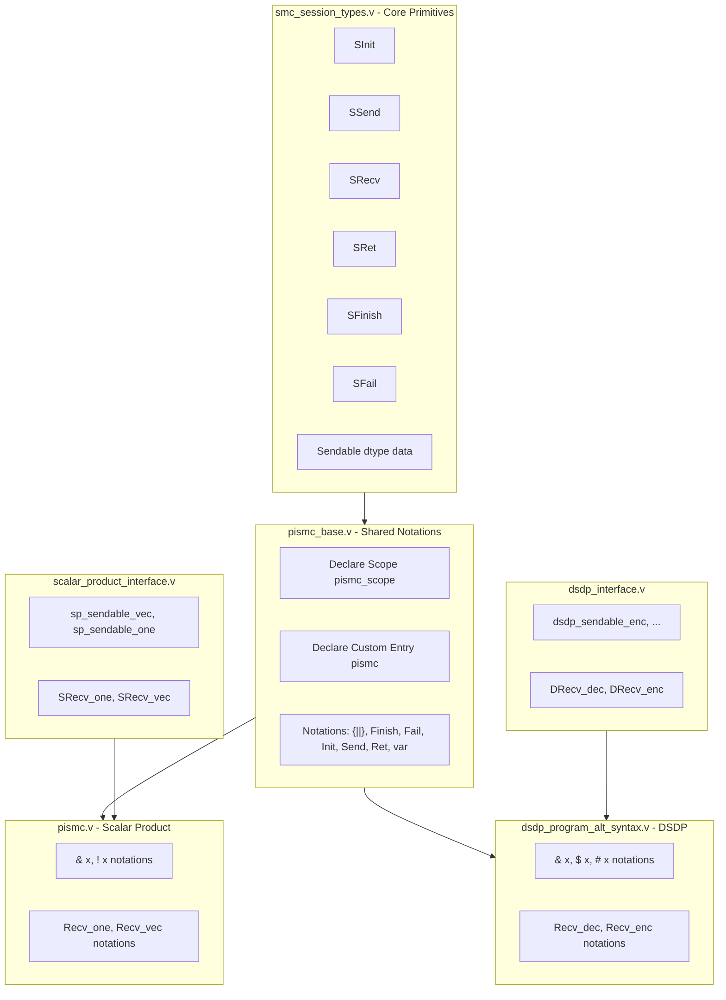

# piSMC Canonical Structures Refactoring Plan

**Status:** Draft - pending review  
**Created:** 2026-01-30

## Overview

Refactor piSMC to use canonical structures for Init/Send/Ret, enabling shared notations across protocols. Data wrappers and Recv stay protocol-specific per user choice.

## Tasks

- [ ] Add Sendable structure and piSend to smc_session_types.v
- [ ] Create pismc_base.v with shared scope, entry, and generic notations
- [ ] Add sp_sendable_vec/one to scalar_product_interface.v
- [ ] Add dsdp_sendable_enc to dsdp_interface.v
- [ ] Refactor pismc.v to import base and keep only data wrappers + Recv
- [ ] Refactor dsdp_program_alt_syntax.v to use pismc_base
- [ ] Add pismc_base.v to _CoqProject

## Architecture



## Key Abstraction: Sendable Structure

Add to `smc/smc_session_types.v`:

```coq
(* Sendable: wrapped data that knows its dtype tag for session type tracking *)
Structure Sendable (dtype : eqType) (data : Type) := {
  sendable_tag : dtype;
  sendable_data : data;
}.

(* Generic piSend using Sendable *)
Definition piSend {dtype data party n env} (dst : nat) 
    (s : Sendable dtype data)
    (p : @sproc dtype data party n env)
    : @sproc dtype data party n.+1 (senv_send env dst (sendable_tag s)) :=
  SSend dst (sendable_tag s) (sendable_data s) p.
```

## New File: pismc_base.v

Create `smc/pismc_base.v` with shared infrastructure:

```coq
(* Scope and custom entry *)
Declare Scope pismc_scope.
Declare Custom Entry pismc.

(* Program delimiter *)
Notation "'{|' e '|}'" := e (e custom pismc at level 99) : pismc_scope.

(* Terminal states - use SFinish/SFail directly *)
Notation "'Finish'" := SFinish (in custom pismc at level 0).
Notation "'Fail'" := SFail (in custom pismc at level 0).

(* Generic Init - uses SInit directly *)
Notation "'Init' x ; P" := (SInit x P)
  (in custom pismc at level 85, x constr at level 0,
   P custom pismc at level 85, right associativity).

(* Generic Send - uses piSend with Sendable *)
Notation "'Send<' p '>' x ; P" := (piSend p x P)
  (in custom pismc at level 85, p constr at level 0, x constr at level 0,
   P custom pismc at level 85, right associativity).

(* Generic Ret - uses SRet directly *)
Notation "'Ret' x" := (SRet x)
  (in custom pismc at level 80, x constr).

(* Variable reference *)
Notation "x" := x (in custom pismc at level 0, x ident).
```

## Protocol-Specific: Sendable Constructors

In `smc/scalar_product_interface.v`, add:

```coq
(* Sendable constructors for scalar product *)
Definition sp_sendable_vec (x : VX) : Sendable sp_dtype data :=
  {| sendable_tag := DT_Vec; sendable_data := vec x |}.

Definition sp_sendable_one (x : TX) : Sendable sp_dtype data :=
  {| sendable_tag := DT_One; sendable_data := one x |}.
```

In `dumas2017dual/dsdp/dsdp_interface.v`, add:

```coq
(* Sendable constructor for DSDP encrypted data *)
Definition dsdp_sendable_enc (x : party_cipher PHE) : Sendable dsdp_dtype data :=
  {| sendable_tag := DT_Enc; sendable_data := e x |}.
```

## Protocol Files: Data Wrappers + Recv (Section-Local)

In `smc/pismc.v` Section:

```coq
Import pismc_base.
Local Open Scope pismc_scope.

(* Data wrappers create Sendable values *)
Notation "& x" := (sp_sendable_vec x) (at level 0, x at level 0) : pismc_scope.
Notation "! x" := (sp_sendable_one x) (at level 0, x at level 0) : pismc_scope.

(* Protocol-specific Recv notations *)
Notation "'Recv_vec<' p '>' 'fun' x '=>' P" := (SRecv_vec p (fun x => P)) ...
Notation "'Recv_one<' p '>' 'fun' x '=>' P" := (SRecv_one p (fun x => P)) ...
```

In `dumas2017dual/dsdp/dsdp_program_alt_syntax.v` Section:

```coq
Import pismc_base.
Local Open Scope pismc_scope.

(* Data wrappers for DSDP *)
Notation "$ x" := (dsdp_sendable_enc x) (at level 0, x at level 0) : pismc_scope.
Notation "& x" := (d x) (at level 0, x at level 0) : pismc_scope.  (* plain data, for Init *)
Notation "# x" := (k x) (at level 0, x at level 0) : pismc_scope.  (* key, for Init *)

(* Protocol-specific Recv notations *)
Notation "'Recv_dec<' p '>' dk 'fun' x '=>' P" := (Recv_dec p dk (fun x => P)) ...
Notation "'Recv_enc<' p '>' 'fun' x '=>' P" := (Recv_enc p (fun x => P)) ...
```

## What's Shared vs Protocol-Specific

| Component | Shared (pismc_base) | Protocol-Specific |
|-----------|---------------------|-------------------|
| Scope/Entry | pismc_scope, pismc | - |
| Delimiter | `{| P |}` | - |
| Terminal | Finish, Fail | - |
| Init | `Init x ; P` | - |
| Send | `Send<p> x ; P` | - |
| Ret | `Ret x` | - |
| Data wrappers | - | `&`, `!`, `$`, `#` |
| Recv | - | Recv_one, Recv_vec, Recv_dec, Recv_enc |

## File Changes Summary

1. **smc/smc_session_types.v** - Add `Sendable` structure and `piSend`
2. **smc/pismc_base.v** (NEW) - Shared scope, entry, and notations
3. **smc/scalar_product_interface.v** - Add `sp_sendable_vec`, `sp_sendable_one`
4. **smc/pismc.v** - Import pismc_base, simplify to just data wrappers + Recv notations
5. **dumas2017dual/dsdp/dsdp_interface.v** - Add `dsdp_sendable_enc`
6. **dumas2017dual/dsdp/dsdp_program_alt_syntax.v** - Import pismc_base, simplify notations
7. **_CoqProject** - Add pismc_base.v
